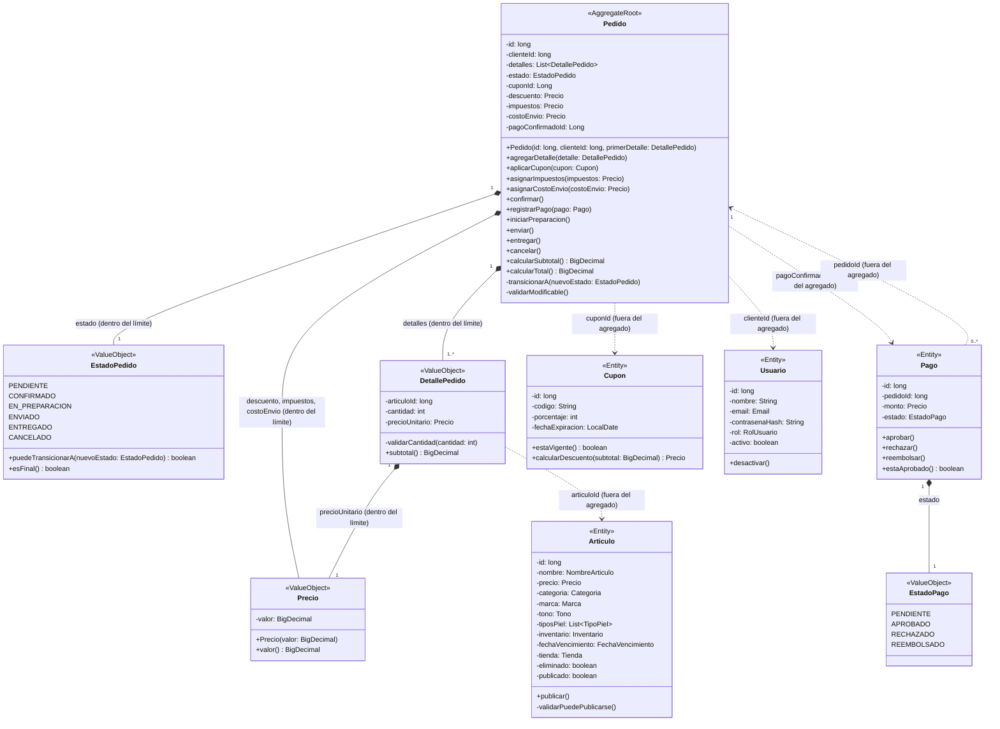

# Diagrama de Agregado --- Pedido

En el "diagrama de agregado" de nuestro e-commerce de belleza elegimos
Pedido como la raíz del agregado, porque representa la compra
realizada por el cliente y es el encargado de controlar las reglas y
operaciones relacionadas con ella.
 
Dentro del agregado ubicamos (EstadoPedido), (DetallePedido) y
(Precio), ya que hacen parte directamente del pedido y deben
mantenerse consistentes junto con él. Por ejemplo, (DetallePedido)
guarda el artículo, la cantidad y el precio unitario utilizado en el
momento de la compra. Así, aunque el precio del artículo cambie
posteriormente, el pedido conserva el precio con el que fue realizado.
(Precio) también se usa para el descuento, los impuestos y el costo de
envío del pedido.
 
Por fuera del agregado dejamos las entidades (Usuario), (Articulo),
(Cupon) y (Pago), porque cada una tiene su propio ciclo de vida y no
depende directamente del pedido para existir. Por eso, (Pedido) las
referencia mediante sus identificadores, como (clienteId), (articuloId),
(cuponId) y (pagoConfirmadoId), en lugar de incluirlas completamente
dentro del agregado. A su vez, (Pago) conoce el pedido al que
pertenece mediante (pedidoId).
 
La entidad (Pedido) también contiene los principales métodos de negocio:
 
- Para armar el pedido: (agregarDetalle()), (aplicarCupon()),
  (asignarImpuestos()) y (asignarCostoEnvio()).
- Para avanzar en su ciclo de vida: (confirmar()), (registrarPago()),
  (iniciarPreparacion()), (enviar()), (entregar()) y (cancelar()).
- Para consultar sus valores: (calcularSubtotal()) y (calcularTotal()).
Estos métodos permiten controlar las modificaciones del pedido mediante
las reglas del negocio y evitar cambios directos que puedan generar
información inconsistente.

## Invariantes del agregado

Las "invariantes" son las reglas que siempre deben cumplirse dentro
del agregado para mantener el pedido correcto y consistente:

1. Un Pedido no puede pasar a EN_PREPARACION si no tiene registrado un pago confirmado.
2. Un Pedido siempre debe contener al menos un DetallePedido. 
3. El precioUnitario de un DetallePedido nunca cambia, aunque después cambie el precio del Artículo original.
4. CANCELADO y ENTREGADO son estados finales: un pedido en cualquiera de ellos no puede pasar a otro estado. Para volver a comprar se requiere un pedido nuevo.
5. El total del Pedido siempre es igual a la suma de (precioUnitario × cantidad) de sus detalles, menos el descuento, más los impuestos y el costo de envío.
6. El descuento nunca puede ser mayor que la suma de los detalles, de modo que el total nunca es negativo.
7. La cantidad de cada DetallePedido debe ser mayor que 0.
8. Los detalles y el cupón solo pueden modificarse mientras el Pedido está en estado PENDIENTE.
9. Un Pedido admite como máximo un cupón.

## Diagrama de agregado Pedido elaborado en Marmaid

